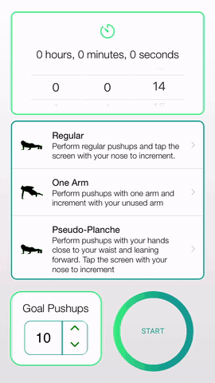
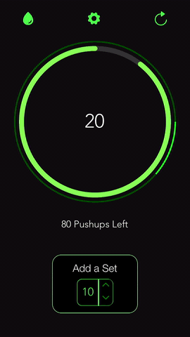

# 1000-Pushups
A React Native mobile app that offers a fun way to keep track of push-ups.

### Counting Push-ups With Your Nose
- Place the device directly below your nose while in the push-up position
- Perform a push-up, aiming your nose at the circular counter (this forces reps to be more slow and controlled as well)

### Custom Incrementing
- Want to count in sets instead? Simply use the custom incrementor at the bottom
- The custom incrementor can be set to negative numbers to remove reps

### Setting Personal Goals
- The app allows you to set a custom target number of repetitions and tracks your progress as you perform push-ups
- The app's built-in timer allows you to set time-limits and track how long it takes you to complete your push-ups

### Pausing
- Tap the 'water drop' button to pause and cover the timer (can be used to clean the screen without accidentally pressing buttons)
- Press and hold the "RESUME" button to start the timer again

  

(Image source: https://www.vecteezy.com/vector-art/162096-man-doing-push-up-vector-illustration)
