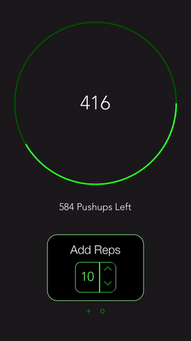
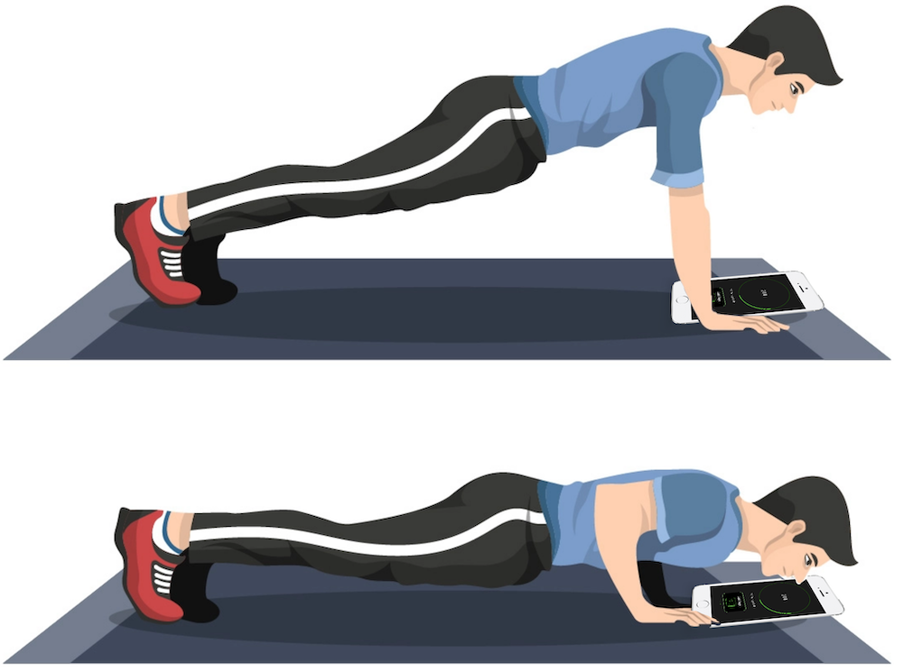

# 1000-Pushups
A React Native mobile app that offers a unique way to keep track of push-ups.

### Count Push-ups With Your Nose
- Place the device directly below your nose while in the push-up position
- Perform a push-up, aiming your nose at the circular counter (this forces reps to be more slow and controlled as well)

### Custom Increments
- Want to count in sets instead? Simply use the custom incrementor at the bottom

### Set Personal Goals
- The app allows you to set a custom target number of repetitions and tracks your progress as you perform push-ups

 

(Image source: https://www.vecteezy.com/vector-art/162096-man-doing-push-up-vector-illustration)
